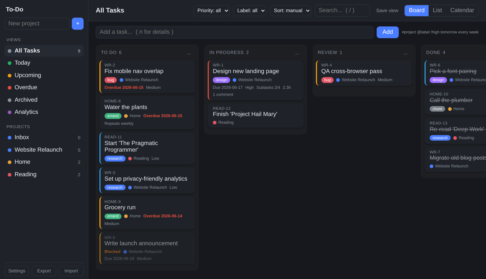
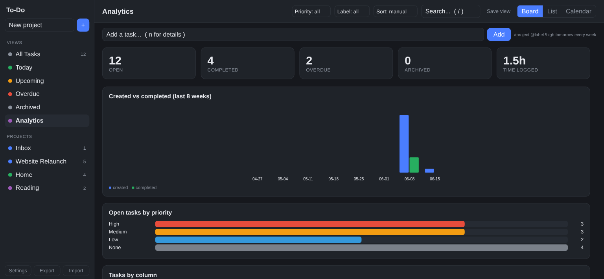
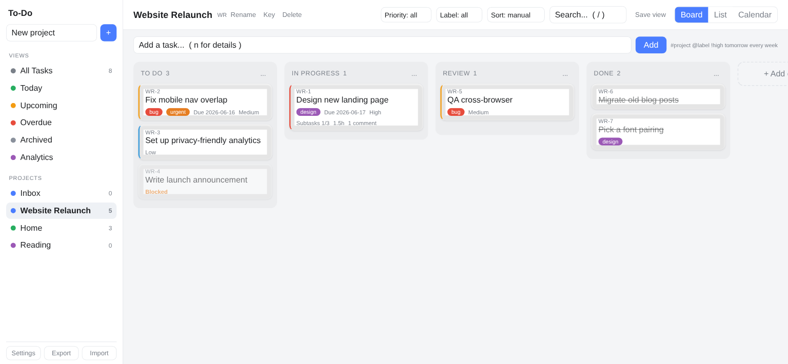
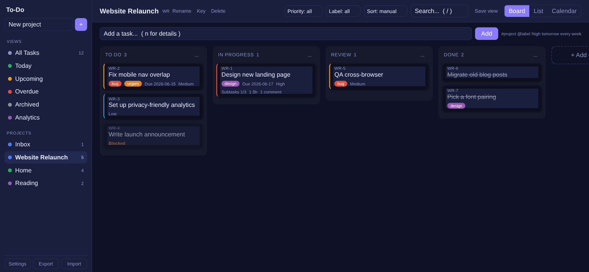

# To-Do — self-hosted task & project board

A fast, self-hosted to-do and project board you run in a single container. It's a
Kanban board, list, and calendar with projects, labels, subtasks, reminders, and
more — backed by SQLite, with **zero third-party dependencies** (Python standard
library only). One small image, one volume, and it's yours.



---

## Features

### 📋 Kanban board, list & calendar
Organize work into **projects**, each with a drag-and-drop board. Add your own
**columns** with optional WIP limits and "done" columns, or switch to a **list**
or a month **calendar** of due dates.


### 🗂️ Rich tasks
Every task has a Jira-style key, **priority**, **due date**, **labels**, a
description, **subtasks** with progress, **comments**, **file attachments**, an
**activity log**, and **time tracking** (estimate vs. logged). Tasks can **depend
on** other tasks — blocked cards are flagged on the board.


### 🔁 Recurring tasks & reminders
Make a task repeat (daily / weekdays / weekly / biweekly / monthly / yearly) and
it respawns when completed. Set a **reminder** and get notified through **ntfy**,
**Telegram**, or **email** — configured in Settings, sent by a built-in scheduler.

### ⚡ Natural-language quick-add
Type `#project @label !high buy milk tomorrow every week` and it's parsed into the
right project, label, priority, due date, and recurrence automatically.

### 📈 Analytics & saved views
A dashboard of throughput (created vs. completed), open work by priority and
column, overdue counts, and total time logged. Save your favorite filter
combinations as one-click **views**.



### 🎨 Themes
Pick a theme in Settings → Appearance — System, Light, Dark, Midnight, Nord,
Solarized, Forest, or Grape. It applies to the web app and the desktop client.

| Light | Nord |
|:-----:|:----:|
|  |  |
| **Midnight** | **Grape** |
|  |  |

### 📦 More
- **Offline-first** web app: keeps working if the server drops, and syncs changes when it's back.
- **PWA**: install to a phone home screen; **iCal feed** to subscribe to due dates in any calendar app.
- **Webhooks** on task events, and a full **JSON export/import** for backup.
- **Opt-in auth**: open on a trusted network by default; set a password to require login, with API tokens for scripts.

---

## Run it

A database from an older version is migrated in place automatically on first start.

```bash
docker run -d --name todo -p 8080:8080 -v "$PWD/data:/data" \
  ghcr.io/<owner>/todo-app:latest
```

Then open `http://localhost:8080`. Or with the bundled compose (recommended), which
also wires up automatic updates:

```bash
docker compose up -d
```

To build from source instead, swap `image:` for `build: .` in `docker-compose.yml`
(or run `docker build -t todo-app .`).

| Env var      | Default               | Purpose                          |
|--------------|-----------------------|----------------------------------|
| `PORT`       | `8080`                | Port the app listens on          |
| `DB_PATH`    | `/data/todo.db`       | SQLite database file location    |
| `ATTACH_DIR` | `/data/attachments`   | Where uploaded files are stored  |

### Automatic updates
Every push to `main` builds and publishes a fresh image to
`ghcr.io/<owner>/todo-app:latest` (GitHub Action). To have your server pick those
up on its own, the bundled `docker-compose.yml` includes a label-scoped
[Watchtower](https://containrrr.dev/watchtower/) service that polls the registry
and pulls + restarts the app when a new image appears (every 5 minutes). It only
touches containers carrying the `com.centurylinklabs.watchtower.enable=true` label,
so it leaves your other apps alone. Your data lives in the `./data` volume and is
untouched across updates.

### Deploy on TrueNAS SCALE (or any container host)
Create a dataset for storage, then add a **Custom App** pointed at
`ghcr.io/<owner>/todo-app:latest`, map container port `8080` to a host port, and
mount your dataset at `/data`. Because it's a registry image, the platform's
**Update** button picks up new versions — or add the Watchtower service above for
fully hands-off updates.

### Files
- `app.py` — backend (Python 3, stdlib only)
- `ui.py` — frontend (HTML/CSS/JS, web manifest, service worker)
- `icons.json` — app/PWA icons
- `Dockerfile`, `docker-compose.yml`

---

## Clients

- **Browser / PWA** — open the app and use "Install" / "Add to Home Screen".
- **Desktop app** — a cross-platform desktop client (Electron) is maintained in its own repository; it opens the board in a native window, works offline, and shows native reminder notifications.

## API

All `/api/*` routes accept and return JSON. With a password set, send a session cookie (browser) or `Authorization: Bearer <token>`.

```
GET    /api/state                          full board state
POST   /api/quickadd      {"text": "..."}  natural-language add
POST   /api/tasks         {"title": ...}   create (priority, due_date, recurrence, reminder_at, …)
GET    /api/tasks/<id>                      task detail (subtasks, comments, deps, attachments, time logs)
PATCH  /api/tasks/<id>     {...}            update / move / {"done": true} / {"archived": true}
DELETE /api/tasks/<id>                      delete
GET    /api/stats                          analytics aggregates
GET    /ical?token=<feed_token>            calendar subscription (read-only)
GET    /healthz                            health check
```

## Notes
- Authentication is **opt-in**; without a password the app and API are open (intended for trusted networks). Don't expose it to the internet without a reverse proxy.
- Backup with the in-app **Export**, by copying `todo.db`, or via storage snapshots.

MIT licensed.
